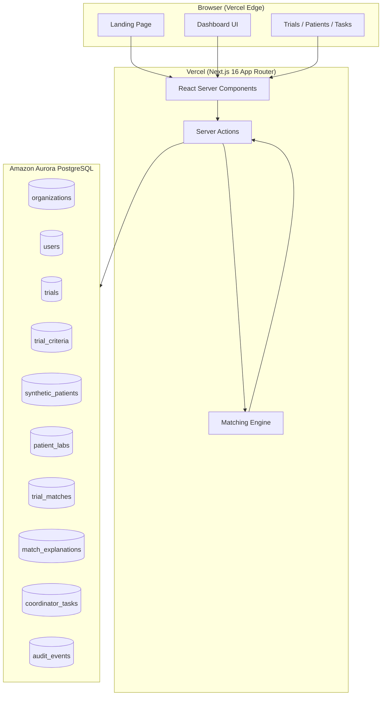
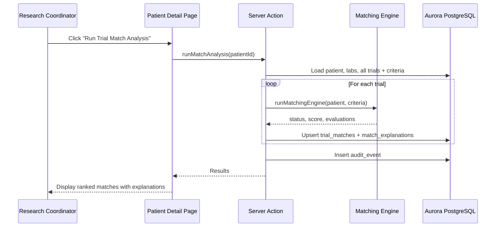

# TrialBridge AI — Architecture

## Overview

TrialBridge AI is a full-stack B2B healthcare research coordination platform built with Next.js, Drizzle ORM, and PostgreSQL (Amazon Aurora in production). It provides research coordinators with tools to screen synthetic patient profiles against clinical trial criteria, with full explainability and audit logging.

## System Architecture



## Components

### 1. Next.js Frontend

- **App Router** with React Server Components for data-heavy pages
- **Client Components** only where interactivity is needed (match analysis triggers, task forms)
- **Tailwind CSS** + shadcn-style component library for professional healthcare SaaS UI
- **Responsive layout** with sidebar navigation for dashboard pages

**Key routes:**

| Route | Purpose |
|-------|---------|
| `/` | Landing page with problem/solution/CTA |
| `/dashboard` | Metrics and activity overview |
| `/trials` | Trial portfolio listing |
| `/trials/[id]` | Trial detail with criteria and matches |
| `/patients` | Synthetic patient listing |
| `/patients/[id]` | Patient profile and match results |
| `/patients/[id]/matches` | Full explainable match report |
| `/tasks` | Coordinator task management |
| `/audit` | Audit trail |

### 2. Server Actions

All backend operations are implemented as Next.js Server Actions in `src/lib/actions/index.ts`:

| Function | Description |
|----------|-------------|
| `listTrials()` | Returns trials with inclusion/exclusion counts |
| `getTrial(id)` | Trial detail with criteria and related matches |
| `listPatients()` | Synthetic patients with labs and missing field flags |
| `getPatient(id)` | Full patient profile with matches |
| `runMatchAnalysis(patientId)` | Runs matching engine against all trials |
| `createTask(matchId, fields)` | Creates coordinator task with audit log |
| `listTasks()` | All tasks with patient/trial context |
| `updateTask(taskId, fields)` | Updates task status/priority |
| `listAuditEvents()` | Audit trail entries |

### 3. Database Layer (Drizzle ORM + Aurora PostgreSQL)

**Adapter pattern:** A single `DATABASE_URL` environment variable works for both local PostgreSQL and production Aurora PostgreSQL. The Drizzle client in `src/db/index.ts` uses lazy initialization via `postgres.js`.

**Schema tables:**

- `organizations` — Hospital/research institution
- `users` — Research coordinators and PIs
- `trials` — Clinical trial metadata
- `trial_criteria` — Structured inclusion/exclusion rules
- `synthetic_patients` — Demo patient profiles (no real PHI)
- `patient_labs` — Lab values linked to patients
- `trial_matches` — Precomputed or on-demand match results
- `match_explanations` — Per-criterion evaluation detail
- `coordinator_tasks` — Workflow tasks for coordinators
- `audit_events` — Immutable action log

**Migrations:** Managed via Drizzle Kit (`drizzle/` folder). Run with `npm run db:migrate`.

### 4. Matching Engine

Located in `src/lib/matching/engine.ts`. **Deterministic rules-based** — no AI/ML for final eligibility classification.

**Algorithm:**

1. For each trial criterion, resolve the patient field (attribute, demographic, or lab value)
2. If field is missing → mark criterion as `missing`
3. Compare value against criterion operator (`eq`, `gte`, `lte`, `contains`, `in`, `true`, `false`)
4. For exclusion criteria: if rule matches → `triggered_exclusion`
5. For inclusion criteria: if rule fails → `failed`
6. Determine status:
   - Any exclusion triggered → **Not Eligible**
   - Any inclusion failed → **Not Eligible**
   - All inclusion met → **Likely Eligible**
   - Some inclusion missing → **Possibly Eligible**
7. Calculate weighted score (0–100), with partial credit for missing fields
8. Generate plain-English summary explanation

**Output per trial:**

- Status: Likely Eligible / Possibly Eligible / Not Eligible
- Score: 0–100
- Per-criterion explanations stored in `match_explanations`

### 5. Audit Trail

Every significant action writes to `audit_events`:

- `match_analysis_run` — When coordinator runs screening
- `task_created` / `task_updated` — Task lifecycle events
- `bulk_tasks_created` — Batch task creation from matches

Fields: `actor`, `action`, `entity_type`, `entity_id`, `details`, `created_at`

### 6. Vercel Deployment

```
GitHub → Vercel Build → Serverless Functions (Server Actions)
                              ↓
                    Aurora PostgreSQL (DATABASE_URL)
```

**Configuration:**

1. Set `DATABASE_URL` in Vercel environment variables (Aurora connection string with SSL)
2. All data pages use `export const dynamic = "force-dynamic"` to avoid static generation without DB
3. Run migrations and seed against Aurora after first deploy

**Local vs Production:**

| Environment | Database | Connection |
|-------------|----------|------------|
| Local | PostgreSQL 14+ | `postgresql://localhost:5432/trialbridge` |
| Production | Aurora PostgreSQL | Vercel env `DATABASE_URL` |

## Data Flow: Match Analysis



## Safety Design

- **No real PHI** — All data is synthetic with `SYN-P-` patient codes
- **Disclaimers** — Visible on landing page and all dashboard pages
- **Human-in-the-loop** — All matches route to coordinator review; no autonomous referrals
- **Explainability** — Every match includes criterion-level detail, not just a score
- **Audit trail** — Full action log for compliance documentation

## Folder Structure

```
src/
├── app/                    # Next.js App Router pages
│   ├── page.tsx            # Landing page
│   ├── dashboard/
│   ├── trials/
│   ├── patients/
│   ├── tasks/
│   └── audit/
├── components/
│   ├── ui/                 # Reusable UI primitives
│   ├── layout/             # Sidebar, header, dashboard layout
│   ├── disclaimer.tsx
│   ├── patient-actions.tsx
│   └── tasks-client.tsx
├── db/
│   ├── schema.ts           # Drizzle schema
│   ├── index.ts            # Database client
│   ├── seed.ts             # Demo data seeder
│   └── migrate.ts          # Migration runner
└── lib/
    ├── actions/            # Server actions
    ├── matching/           # Rules-based matching engine
    └── utils.ts
drizzle/                    # SQL migrations
```
